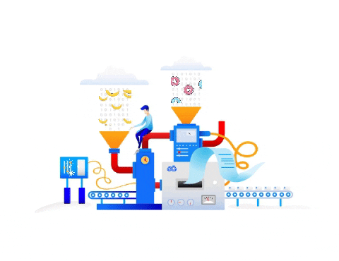

#  👋 Bem-vindo!

  

  
  

Sou um profissional de dados apaixonado por tecnologia e aprendizado contínuo. Meu foco é transformar dados em insights estratégicos.

-  💡 Profissional de Dados
-  📊 Python | SQL | Power BI | Excel | Automação | Dashboards
- 🚀 Apaixonado por tecnologia, dados e aprendizado contínuo
- 🎓 Estudante de Análise e Desenvolvimento de Sistemas

  &nbsp;
  &nbsp;
  &nbsp;
  &nbsp;
  &nbsp;

---

